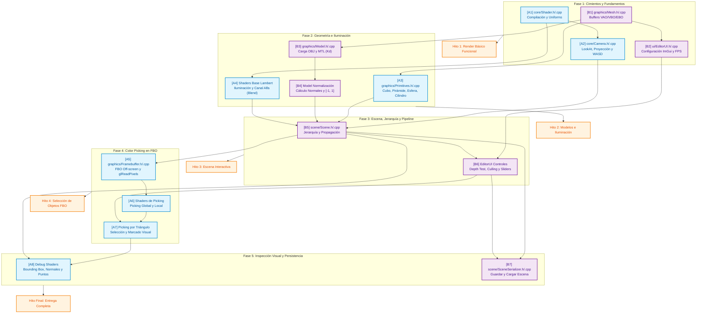

# Plan de Trabajo, Fases y Mapa de Dependencias

**Proyecto #2 - Renderizado y Manipulación de Objetos 3D**  
*Guía pedagógica para desarrollo colaborativo en parejas*

---

## 🧭 1. Recomendaciones y Buenas Prácticas de Ingeniería

1. **Diseño por Contratos en Encabezados (`.h`):**
   - Antes de escribir el código de una funcionalidad, ambos integrantes deben acordar la firma de los métodos en el archivo de cabecera (`.h`).
   - Una vez consensuado el `.h`, ambos desarrolladores pueden trabajar en sus archivos `.cpp` en paralelo sin bloquearse mutuamente.
2. **Flujo de Trabajo en Git (Feature Branches):**
   - Nunca hacer *commits* directamente en la rama principal (`main`).
   - Crear una rama por cada requisito o tarea (ejemplo: `feat/REQ-A1-shader`, `feat/REQ-B3-obj-loader`).
   - Realizar integración mediante *Pull Requests* o *Merges* tras comprobar que el proyecto compila limpiamente sin advertencias (`cmake --build build`).
3. **Curva de Aprendizaje Incremental:**
   - No intentar implementar técnicas complejas (como el *Color Picking* con FBOs) sin antes tener el renderizado básico y las matrices de cámara funcionando de manera robusta.
   - Probar cada módulo de forma aislada antes de integrarlo en la escena general.

---

## 🗺️ 2. Mapa Integral de Dependencias

El siguiente diagrama ilustra las dependencias técnicas entre cada tarea y cómo se distribuye el trabajo en paralelo entre el **Desarrollador A** y el **Desarrollador B**:

---

## 📅 3. Desglose de Fases de Desarrollo

### 🟢 FASE 1: Cimientos y Fundamentos de OpenGL
* **Objetivo:** Establecer la infraestructura base de compilación de shaders, estructuración de memoria en la GPU y movimiento en el espacio tridimensional.
* **Tareas en Paralelo:**
  - **Dev A:** `[A1]` Implementación de `core/Shader` (manejo de archivos de shaders y uniformes). A continuación, `[A2]` `core/Camera` (matrices LookAt, proyección en perspectiva y controles WASD + Mouse).
  - **Dev B:** `[B1]` Implementación de `graphics/Mesh` (encapsulación de VAO, VBO, EBO con layout de vértice: posición, normal, coordenadas de textura). A continuación, `[B2]` `ui/EditorUI` (inicialización de Dear ImGui con GLFW/OpenGL3 y despliegue del medidor de FPS).
* **Entregable del Hito 1:** Una ventana interactiva donde la cámara puede navegar en el espacio y renderizar un triángulo con un shader básico, mostrando el panel de ImGui con los FPS.

---

### 🟡 FASE 2: Geometría e Iluminación
* **Objetivo:** Disponer de todas las formas geométricas (tanto matemáticas como importadas) con el modelo de reflexión difusa (Lambert).
* **Tareas en Paralelo:**
  - **Dev A:** `[A3]` Generación procedimental de primitivas matemáticas en `graphics/Primitives` (Cubo, Pirámide, Esfera y Cilindro con cálculo analítico de normales). A continuación, `[A4]` Puesta a punto de `assets/shaders/default.vert` y `default.frag` (Lambert provisto por la cátedra más configuración de `GL_BLEND` con canal alfa).
  - **Dev B:** `[B3]` Parseo de archivos `.obj` y extracción del color difuso $K_d$ de archivos `.mtl` en `graphics/Model` con `tinyobjloader`. A continuación, `[B4]` Algoritmo de normalización (centrado y escalado al rango $[-1, 1]$) y cálculo automático de normales promedio por producto cruz para modelos que carecen de ellas.
* **Entregable del Hito 2:** Visualización simultánea de primitivas (cubo, esfera, etc.) y mallas cargadas por OBJ con iluminación difusa suave y soporte de transparencia alfa.

---

### 🟠 FASE 3: Escena, Jerarquía y Control de Pipeline
* **Objetivo:** Administrar los objetos como entidades dentro de un mundo coherente y permitir la manipulación de estados gráficos.
* **Tareas en Paralelo:**
  - **Dev A:** Asistir en la verificación matemática de las matrices de rotación sobre el propio eje local y pruebas de consistencia geométrica.
  - **Dev B:** `[B5]` Implementación de `scene/Scene` y `SceneObject` (gestión de lista de entidades, matrices de traslación, rotación local, escalado, eliminación y propagación jerárquica obligatoria hacia sub-mallados). A continuación, `[B6]` Incorporación en `EditorUI` de conmutadores para **Depth Test** (`GL_DEPTH_TEST`), **Back-Face Culling** (`GL_CULL_FACE`), color de fondo (`glClearColor`), sliders de transformación y botón para vaciar la escena.
* **Entregable del Hito 3:** Un editor 3D completamente operable donde se pueden instanciar objetos, transformarlos desde la interfaz, cambiar el fondo de pantalla y conmutar el Depth Test y el Culling.

---

### 🔴 FASE 4: Selección Interactiva por Color Picking (FBO)
* **Objetivo:** Dominar el renderizado fuera de pantalla para conseguir una selección de objetos pixel-perfect con el cursor.
* **Tareas en Paralelo:**
  - **Dev A:** `[A5]` Implementación de `graphics/Framebuffer` (creación de FBO, textura RGB de color y renderbuffer de profundidad, con lectura síncrona `glReadPixels`). Seguidamente, `[A6]` Shaders de picking (`picking.vert` / `picking.frag`) para codificación y decodificación de IDs en modo Global (objeto entero) y modo Local (sub-mallado individual). Por último, `[A7]` Extensión al modo Triángulo con marcado visual del polígono seleccionado.
  - **Dev B:** Conectar la respuesta del Color Picking con la escena y la interfaz: al hacer clic, actualizar el objeto o sub-mallado seleccionado en `Scene` y sincronizar los paneles de propiedades de `EditorUI`.
* **Entregable del Hito 4:** Al hacer clic sobre cualquier objeto de la escena con el mouse, este se selecciona automáticamente (en nivel global, local o por triángulo individual resaltado).

---

### 🟣 FASE 5: Depuración Geométrica y Persistencia
* **Objetivo:** Cumplir con los requisitos de inspección geométrica avanzada y almacenamiento permanente en disco.
* **Tareas en Paralelo:**
  - **Dev A:** `[A8]` Implementación de los modos de inspección sobre la entidad seleccionada: cálculo y renderizado del Bounding Box (AABB en wireframe), visualización de normales vectoriales (`GL_LINES`) y visualización de vértices en modo puntos (`GL_POINTS`).
  - **Dev B:** `[B7]` Implementación de `scene/SceneSerializer` para serializar a archivo de texto / JSON y deserializar la escena completa (objetos, transformaciones, materiales, iluminación y fondo), integrando los botones de "Guardar Escena" y "Cargar Escena" en la UI.
* **Entregable del Hito 5 (Final):** Aplicación completa lista para la defensa oral, cumpliendo el 100% de los requisitos obligatorios y de parejas.

---

## 👥 4. Matriz de Responsabilidades y Asignación de Módulos

| Módulo / Archivos | Responsable Principal | Rol del Compañero |
| :--- | :---: | :--- |
| `src/core/Shader.h/.cpp` | **Dev A** | Consumo y validación en renderizado |
| `src/core/Camera.h/.cpp` | **Dev A** | Integración en bucle principal |
| `src/graphics/Mesh.h/.cpp` | **Dev B** | Consumo en shaders y render |
| `src/graphics/Primitives.h/.cpp` | **Dev A** | Registro en la escena |
| `src/graphics/Model.h/.cpp` | **Dev B** | Revisión de cálculo de normales |
| `src/graphics/Framebuffer.h/.cpp` | **Dev A** | Integración en eventos del mouse |
| `src/scene/Scene.h/.cpp` | **Dev B** | Soporte para selección y picking |
| `src/scene/SceneSerializer.h/.cpp` | **Dev B** | Pruebas de persistencia cruzada |
| `src/ui/EditorUI.h/.cpp` | **Dev B** | Enlace de controles de picking |
| `src/main.cpp` | **Compartido** | Integración continua en cada hito |
| `assets/shaders/*` | **Dev A** | Verificación de uniforms y compatibilidad |
