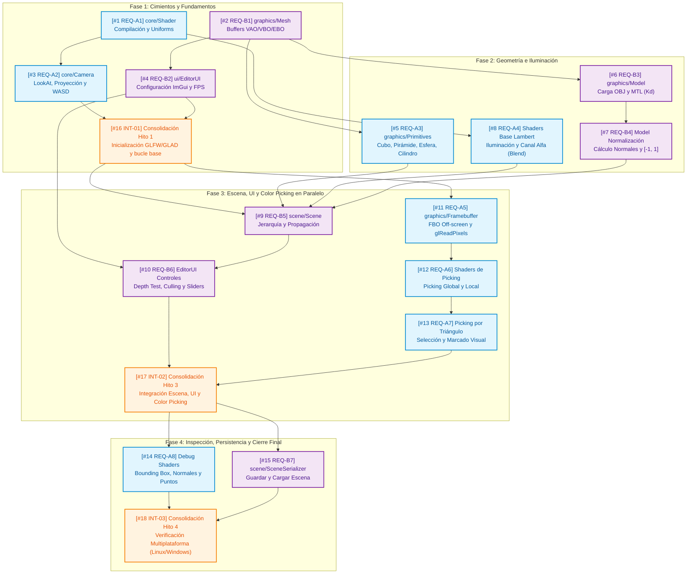

# Plan de Trabajo, Fases y Mapa de Dependencias

**Proyecto #2 - Renderizado y Manipulación de Objetos 3D**  
*Guía pedagógica para desarrollo colaborativo en paralelo (Linux / Windows)*

---

## 🧭 1. Recomendaciones y Buenas Prácticas de Ingeniería

1. **Diseño por Contratos en Encabezados (`.h`):**
   - Antes de escribir la implementación de cualquier módulo, ambos integrantes acuerdan la firma de los métodos en el archivo de cabecera (`.h`).
   - Una vez consensuado el `.h`, ambos desarrolladores pueden trabajar en sus archivos `.cpp` en paralelo sin bloquearse mutuamente.
2. **Flujo de Trabajo en Git (Feature Branches asociadas a Issues):**
   - Nunca hacer *commits* directamente en la rama principal (`main`).
   - Crear una rama por cada tarea utilizando el código de issue (ejemplo: `feat/REQ-A1-shader`, `feat/REQ-B3-obj-loader`).
   - Realizar integración mediante *Pull Requests* (PR) tras comprobar que el proyecto compila limpiamente sin advertencias (`cmake --build build`).
3. **Puntos de Consolidación Explícitos en `src/main.cpp`:**
   - Para evitar que ambos integrantes editen `src/main.cpp` simultáneamente durante el desarrollo individual, este archivo se modifica **únicamente en los 3 hitos de consolidación conjunta (`INT-01`, `INT-02` e `INT-03`)**.

---

## 🗺️ 2. Mapa Integral de Dependencias (Flujo Paralelo)

El siguiente diagrama ilustra la arquitectura de dependencias técnicas y demuestra cómo **Dev A** y **Dev B** trabajan simultáneamente sin esperarse, convergiendo en los puntos de consolidación en `src/main.cpp`:

---

## 📅 3. Desglose de Fases de Desarrollo

### 🟢 FASE 1: Cimientos y Fundamentos de OpenGL (Milestone #1)
* **Objetivo:** Establecer la infraestructura base de compilación de shaders, estructuración de memoria en la GPU y movimiento en el espacio tridimensional.
* **Trabajo en Paralelo:**
  - **Dev A:** `[#1 REQ-A1]` Implementación de `core/Shader` (lectura de disco y uniformes). Seguidamente, `[#3 REQ-A2]` `core/Camera` (matrices LookAt, proyección en perspectiva y controles WASD + Mouse).
  - **Dev B:** `[#2 REQ-B1]` Implementación de `graphics/Mesh` (encapsulación de VAO, VBO, EBO con layout de vértices y modos de dibujo). Seguidamente, `[#4 REQ-B2]` `ui/EditorUI` (inicialización de Dear ImGui con GLFW/OpenGL3 y medidor de FPS).
* **🤝 Punto de Consolidación Conjunta (`[#16 INT-01]`):**
  - Ambos desarrolladores trabajan en `src/main.cpp` para inicializar GLFW, cargar GLAD, conectar los callbacks de la cámara y abrir la ventana con una geometría de prueba y el panel de FPS.

---

### 🟡 FASE 2: Geometría e Iluminación (Milestone #2)
* **Objetivo:** Disponer de todas las formas geométricas (tanto procedimentales como importadas) con el modelo de reflexión difusa (Lambert).
* **Trabajo en Paralelo:**
  - **Dev A:** `[#5 REQ-A3]` Generación procedimental de primitivas matemáticas en `graphics/Primitives` (Cubo, Pirámide, Esfera y Cilindro con cálculo analítico de normales). A continuación, `[#8 REQ-A4]` Puesta a punto de `assets/shaders/default.vert` y `default.frag` (Lambert provisto por la cátedra más configuración de `GL_BLEND` con canal alfa).
  - **Dev B:** `[#6 REQ-B3]` Parseo de archivos `.obj` y extracción del color difuso $K_d$ de archivos `.mtl` en `graphics/Model` con `tinyobjloader`. A continuación, `[#7 REQ-B4]` Algoritmo de normalización (centrado y escalado al rango $[-1, 1]$) y cálculo de normales promedio para modelos que carecen de ellas.
* **Entregable del Hito 2:** Biblioteca geométrica completa y shaders difusos validados para recibir cualquier modelo.

---

### 🟠 FASE 3: Escena, UI y Color Picking en Paralelo (Milestone #3)
* **Objetivo:** Mientras el Dev B construye la gestión de entidades y controles de UI, el Dev A implementa el sistema de selección por búfer fuera de pantalla (FBO). **Ambos avanzan simultáneamente**.
* **Trabajo en Paralelo:**
  - **Dev B (Línea de Escena y UI):**
    - `[#9 REQ-B5]` Implementación de `scene/Scene` y `SceneObject` (jerarquía de transformaciones, rotación en propio eje local, eliminación y propagación hacia sub-mallados).
    - `[#10 REQ-B6]` Controles en `EditorUI` para conmutar **Depth Test**, **Back-Face Culling**, color de fondo (`glClearColor`), sliders de transformación y borrado total de escena.
  - **Dev A (Línea de Selección y Shaders):**
    - `[#11 REQ-A5]` Implementación de `graphics/Framebuffer` (creación de FBO, textura RGB de color, renderbuffer de profundidad y lectura con `glReadPixels`).
    - `[#12 REQ-A6]` Shaders de picking (`picking.vert` / `picking.frag`) para codificación y decodificación de IDs en modo Global (objeto entero) y modo Local (sub-mallado individual).
    - `[#13 REQ-A7]` Selección por Triángulo individual y su marcado visual distintivo.
* **🤝 Punto de Consolidación Conjunta (`[#17 INT-02]`):**
  - Ambos desarrolladores unifican en `src/main.cpp` la llamada a `scene.render()` con el evento de clic del ratón que dispara la pasada en el `Framebuffer` de picking, conectando la selección con los paneles de propiedades de `EditorUI`.

---

### 🟣 FASE 4: Inspección Geométrica, Persistencia y Cierre Final (Milestone #4)
* **Objetivo:** Cumplir con los requisitos de depuración avanzada y almacenamiento permanente en disco, garantizando la compatibilidad multiplataforma en Linux y Windows.
* **Trabajo en Paralelo:**
  - **Dev A:** `[#14 REQ-A8]` Implementación de los modos de inspección sobre la entidad seleccionada: cálculo y renderizado del Bounding Box (AABB en wireframe), visualización de normales vectoriales (`GL_LINES`) y visualización de vértices en modo puntos (`GL_POINTS`).
  - **Dev B:** `[#15 REQ-B7]` Implementación de `scene/SceneSerializer` para serializar a archivo de texto / JSON y deserializar la escena completa (objetos, transformaciones, materiales, iluminación y fondo), con botones en ImGui.
* **🤝 Punto de Consolidación Conjunta (`[#18 INT-03]`):**
  - Pruebas cruzadas obligatorias: Compilar y verificar el funcionamiento completo en **Linux** y en **Windows**.
  - Empaquetado final del archivo `.zip` para entrega formal y preparación para la defensa oral.

---

## 👥 4. Matriz de Responsabilidades y Asignación de Módulos

| Módulo / Archivos | Responsable Principal | Rol del Compañero |
| :--- | :---: | :--- |
| `src/core/Shader.h/.cpp` ([#1](https://github.com/MiguelCiav/proyecto-2-grafica/issues/1)) | **Dev A** | Consumo y validación en renderizado |
| `src/core/Camera.h/.cpp` ([#3](https://github.com/MiguelCiav/proyecto-2-grafica/issues/3)) | **Dev A** | Consumo en bucle principal |
| `src/graphics/Mesh.h/.cpp` ([#2](https://github.com/MiguelCiav/proyecto-2-grafica/issues/2)) | **Dev B** | Consumo en shaders y render |
| `src/ui/EditorUI.h/.cpp` (Base) ([#4](https://github.com/MiguelCiav/proyecto-2-grafica/issues/4)) | **Dev B** | Enlace de eventos y FPS |
| `src/graphics/Primitives.h/.cpp` ([#5](https://github.com/MiguelCiav/proyecto-2-grafica/issues/5)) | **Dev A** | Registro en la escena |
| `src/graphics/Model.h/.cpp` ([#6](https://github.com/MiguelCiav/proyecto-2-grafica/issues/6), [#7](https://github.com/MiguelCiav/proyecto-2-grafica/issues/7)) | **Dev B** | Revisión de cálculo de normales |
| `assets/shaders/default.*` ([#8](https://github.com/MiguelCiav/proyecto-2-grafica/issues/8)) | **Dev A** | Verificación de uniforms y blending |
| `src/scene/Scene.h/.cpp` ([#9](https://github.com/MiguelCiav/proyecto-2-grafica/issues/9)) | **Dev B** | Soporte para selección y picking |
| `src/ui/EditorUI.h/.cpp` (Controles) ([#10](https://github.com/MiguelCiav/proyecto-2-grafica/issues/10)) | **Dev B** | Enlace de controles de picking |
| `src/graphics/Framebuffer.h/.cpp` ([#11](https://github.com/MiguelCiav/proyecto-2-grafica/issues/11)) | **Dev A** | Integración en eventos del mouse |
| `assets/shaders/picking.*` ([#12](https://github.com/MiguelCiav/proyecto-2-grafica/issues/12), [#13](https://github.com/MiguelCiav/proyecto-2-grafica/issues/13)) | **Dev A** | Conexión con IDs de escena |
| `assets/shaders/debug.*` ([#14](https://github.com/MiguelCiav/proyecto-2-grafica/issues/14)) | **Dev A** | Conexión con AABB de escena |
| `src/scene/SceneSerializer.h/.cpp` ([#15](https://github.com/MiguelCiav/proyecto-2-grafica/issues/15)) | **Dev B** | Pruebas de persistencia cruzada |
| `src/main.cpp` (`INT-01`, `INT-02`, `INT-03`) ([#16](https://github.com/MiguelCiav/proyecto-2-grafica/issues/16), [#17](https://github.com/MiguelCiav/proyecto-2-grafica/issues/17), [#18](https://github.com/MiguelCiav/proyecto-2-grafica/issues/18)) | **Compartido (Dev A + Dev B)** | Integración conjunta en cada hito |
